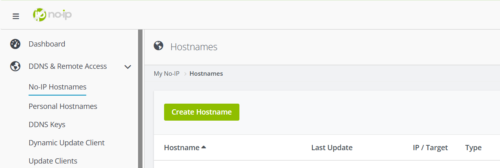

# 🚀 N8N Docker Deployment with Certbot & Automation

[](https://aws.amazon.com/)  [](https://www.docker.com/)  [](https://nginx.org/)  [](https://certbot.eff.org/)  [](https://n8n.io/)  [](https://www.gnu.org/software/bash/)  [](https://aws.amazon.com/s3/)  [](https://en.wikipedia.org/wiki/Cron)  

---

## 📖 Overview  

This repository documents how to deploy **N8N** on an AWS **EC2 instance** using **Docker Compose**, with the following automated tasks:  

- 🔄 **Weekly backups** of N8N data to **Amazon S3**.  
- 🔐 Automatic **SSL certificate renewal** with **Certbot** + **Nginx reload**.  
- 📦 Auto-update of the **N8N container** to the latest version and cleanup of old images.  

The deployment uses **Nginx** as a reverse proxy, **Certbot** for HTTPS, and simple **bash scripts with cron jobs** for automation.  

---

## 📁 Folder Structure

This project is organized into two stages:

### Stage 1 — Base Deployment  

```bash
N8N_Docker_Deploy_With_Certbot/
│
│   docker-compose.yaml       # Main Docker services (n8n, nginx, certbot)
│   LICENSE
│   README.md                 # Documentation (this file)
│
├───certbot
│   ├───conf                  # Certbot configuration (certificates live here)
│   └───www                   # Certbot webroot (for domain verification)
│
└───nginx
    │   startup.sh            # Entry script for Nginx container
    │
    └───templates
            full.conf         # Nginx config for HTTPS (443)
            http.conf         # Nginx config for HTTP (80, redirects to HTTPS)
```
#### Stage 2 — With Automation Scripts

```bash
N8N_Docker_Deploy_With_Certbot/
│
│   backup_n8n_volume.sh          # Weekly backup to S3
│   renew_cert_and_reload_nginx.sh # Renew SSL & reload Nginx
│   update_n8n.sh                 # Pull latest N8N & restart
│   docker-compose.yaml
│   LICENSE
│   README.md
│
├───certbot
│   ├───conf
│   └───www
│
└───nginx
    │   startup.sh
    │
    └───templates
            full.conf
            http.conf
```

# 🛠️ Steps to Setup N8N on EC2  

1. **Clone this repository** to your EC2 instance and run the provided `docker-compose.yaml`.  
2. **Manually replicate the process** on your EC2 instance using the commands below.  

---

## ⚡ Prerequisite: Install Docker  

Before continuing, ensure **Docker** is installed on your EC2 instance.  

👉 Follow the official [Docker installation guide for Ubuntu](https://docs.docker.com/engine/install/ubuntu/).  

---

Now before doing anything on the EC2, we need to create our domain. We will be using the [NoIP.com](https://www.noip.com/) platform since we can get a free domain for 1 month.

Steps to setup your domain on NoIP:

## 🌐 Domain Setup (No-IP)  

We’ll use [NoIP.com](https://www.noip.com/) to get a **free domain (1 month trial)**.  

1. Go to [NoIP.com](https://www.noip.com/) and **sign up**.  
2. Navigate to **DDNS & Remote Access → Hostnames → Create Hostname**.  
3. Enter a hostname, choose one of the free domains, and set your **EC2 public IP** as the target.  

📸 Example (creating hostname):  
  

After obtaining the hostname, update the following files with your domain:  

- `docker-compose.yaml`  
- `nginx/startup.sh`  
- `nginx/templates/http.conf`  
- `nginx/templates/full.conf`  

⚠️ **Important:** In `nginx/templates/full.conf`, make sure:  

```nginx
proxy_pass http://n8n:5678;
```
matches the N8N container service name and port.

🖥️ EC2 Instance Setup

#### 1. (Optional) Add Swap Memory (for Free Tier)

If you are using a small EC2 instance (like free tier), add 1GB swap to prevent Docker from running out of memory:

```bash
# If we are using the default EC2 instance in the free tier, we can use the following commands to swap 1 GB from the storage of the EC2 instance to RAM just for making sure the docker has enough memory to keep working. 

sudo fallocate -l 1G /swapfile
sudo chmod 600 /swapfile
sudo mkswap /swapfile
sudo swapon /swapfile

# To make it permanent (persist after reboot):

echo '/swapfile none swap sw 0 0' | sudo tee -a /etc/fstab
```

#### 2. Create Folder Structure

Run these commands to create the required directories and configuration files:

```bash
# Create certbot folders
mkdir -p certbot/www
mkdir -p certbot/conf

# Create nginx folder structure
mkdir -p nginx/templates

touch nginx/startup.sh
chmod +x nginx/startup.sh # to make the script executable

# Create the templates configuration files
touch nginx/startup.sh nginx/templates/{http.conf,full.conf}

# Set ownership to current user (Only if needed)
sudo chown -R $USER:$USER certbot nginx

# Set reasonable permissions (Only if needed)
chmod -R 755 certbot
chmod -R 755 nginx

# when running the certbot for the first time, run these commands:

# Start only nginx (so Certbot can validate domain)
docker compose up -d nginx

# Obtain initial SSL certificates interactively
docker compose run --rm certbot

# Start all containers (N8N + Nginx + Certbot)
docker compose up -d
```

#### 📌 Note:

- Ensure you update the email and domain name inside your configuration files.

- Without this, Certbot will fail to generate certificates.

<br>

⚙️ Automation Scripts:

#### 1. Renew Certbot Certificate Script:

```bash
#!/bin/bash

# Define volumes relative to the current directory of your project
CERTBOT_WWW="$(pwd)/certbot/www"
CERTBOT_CONF="$(pwd)/certbot/conf"

# Run Certbot renewal using Docker
docker run --rm \
  -v "$CERTBOT_WWW:/var/www/certbot" \
  -v "$CERTBOT_CONF:/etc/letsencrypt" \
  certbot/certbot certonly --webroot -w /var/www/certbot \
  --agree-tos --no-eff-email \
  --email useryser438@gmail.com \
  -d n8n-6ixrams.zapto.org \
  --noninteractive

# Reload NGINX container to apply new certs
docker exec nginx nginx -s reload
```

#### 2. Update N8N image Script (If there is an updated version):

```bash
#!/bin/bash

# Script to update n8n weekly if a new version is available

# Get current image ID
CURRENT_IMAGE_ID=$(docker images --format "{{.Repository}}:{{.Tag}} {{.ID}}" | grep "n8nio/n8n:latest" | awk '{print $2}')

echo "Current n8n image ID: $CURRENT_IMAGE_ID"

# Pull the latest image
# echo "Pulling latest n8n image..."
docker pull n8nio/n8n

# Get new image ID
NEW_IMAGE_ID=$(docker images --format "{{.Repository}}:{{.Tag}} {{.ID}}" | grep "n8nio/n8n:latest" | awk '{print $2}')

echo "New n8n image ID: $NEW_IMAGE_ID"

# Compare IDs
if [ "$CURRENT_IMAGE_ID" != "$NEW_IMAGE_ID" ]; then
    echo "✅ New version detected. Updating n8n..."

    # Restart only the n8n container with the new image
    docker compose up -d --no-deps --build n8n

    # Remove old image
    docker rmi "$CURRENT_IMAGE_ID"

    echo "🎉 n8n updated successfully without restarting nginx/certbot."
else
    echo "ℹ No new version found. Skipping update."
fi
```

#### 3. Backup N8N Volume Script:

Before being able to run this script, we will need to setup aws cli in our EC2 instance to be able to access our S3 bucket from the EC2.

in our EC2 instance, we first run this command `sudo snap install aws-cli --classic` to install the aws-cli, now we can place our aws configuration using `aws configure` command, then we will need to fill in these attributes:

| Secret Name                | Description                     |
| -------------------------- | ------------------------------- |
| `AWS_ACCESS_KEY_ID`        | AWS access key                  |
| `AWS_SECRET_ACCESS_KEY`    | AWS secret access key           |
| `AWS_DEFAULT_REGION`       | Region (e.g., us-central-1)     |

After filling out these attributes and creating the S3 bucket in your AWS dashboard, we place the name of the S3 bucket in this script and everything will work.

#### backup_n8n_volume.sh:

```bash
#!/bin/bash

# === CONFIG ===
VOLUME_NAME="ubuntu_n8n_data"
BUCKET_NAME="n8n-volume-backup"
BACKUP_DIR="$HOME/n8n_backups"
TIMESTAMP=$(date +"%Y-%m-%d_%H-%M-%S")
BACKUP_FILE="n8n_data_backup_$TIMESTAMP.tar.gz"
LOG_FILE="$BACKUP_DIR/n8n_backup.log"

# === PREPARE DIRECTORIES ===
mkdir -p "$BACKUP_DIR"

# === CREATE BACKUP ===
echo "[$(date)] Starting backup..." >> "$LOG_FILE"

docker run --rm \
  -v $VOLUME_NAME:/volume \
  -v $BACKUP_DIR:/backup \
  alpine \
  tar czf /backup/$BACKUP_FILE -C /volume . >> "$LOG_FILE" 2>&1

if [ $? -ne 0 ]; then
  echo "[$(date)] ❌ Error during Docker volume backup." >> "$LOG_FILE"
  exit 1
fi

# === UPLOAD TO S3 ===
aws s3 cp "$BACKUP_DIR/$BACKUP_FILE" s3://$BUCKET_NAME/$BACKUP_FILE >> "$LOG_FILE" 2>&1

if [ $? -eq 0 ]; then
  echo "[$(date)] ✅ Successfully uploaded $BACKUP_FILE to S3." >> "$LOG_FILE"
  rm -f "$BACKUP_DIR/$BACKUP_FILE"
else
  echo "[$(date)] ❌ Failed to upload $BACKUP_FILE to S3." >> "$LOG_FILE"
fi
```

## CronJob Schedule:

This is the schedule for the scripts. It can be accessed using `crontab -e` command:


**Schedule Commands:**

```bash
0 3 * * * /home/ubuntu/renew_cert_and_reload_nginx.sh >> /home/ubuntu/renew_log.txt 2>&1
0 1 * * 1 /home/ubuntu/backup_n8n_volume.sh
0 2 * * 1 /home/ubuntu/update_n8n.sh
```

## 🗺️ Deployment Architecture

flowchart TD <br>
>    A[User Browser] -->|HTTPS| B[Nginx Reverse Proxy]
    B -->|Proxy to 5678| C[N8N Container]
    B --> D[Certbot SSL Renewal]
    C --> E[N8N Data Volume]
    E -->|Weekly Backup| F[(Amazon S3 Bucket)]


